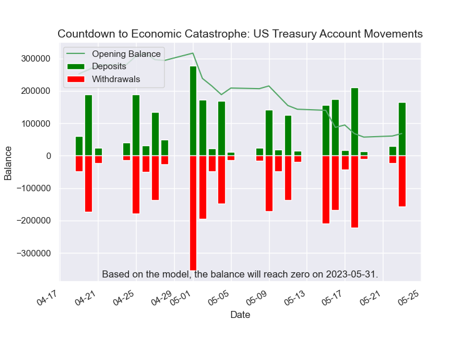
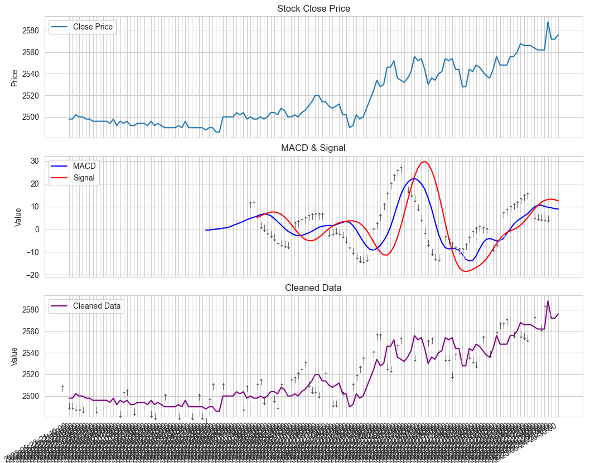
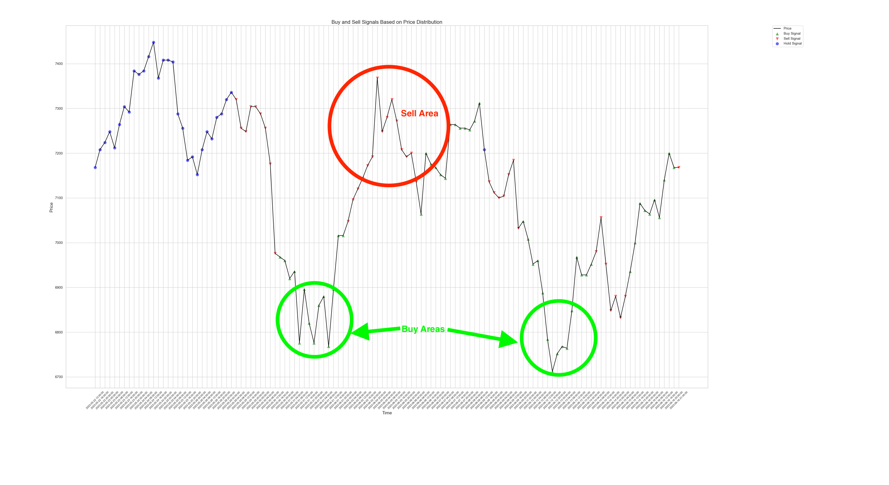
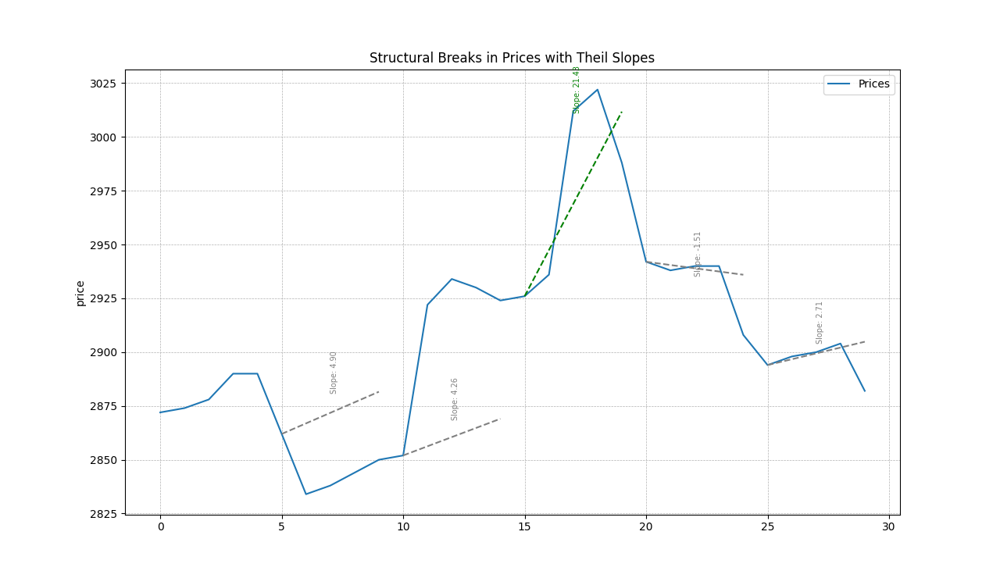
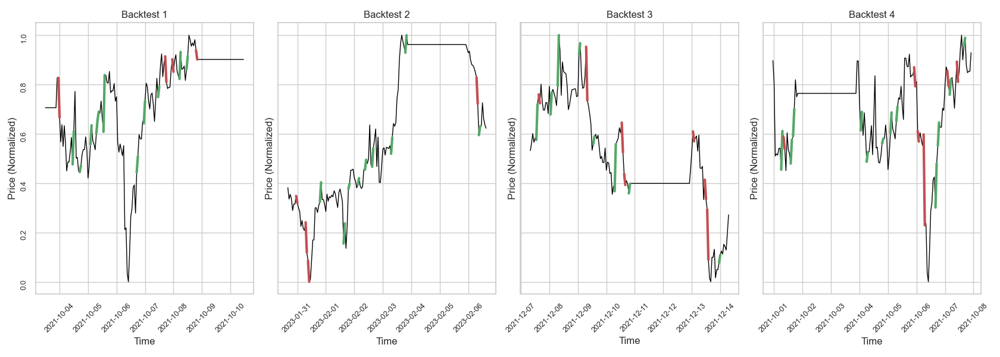
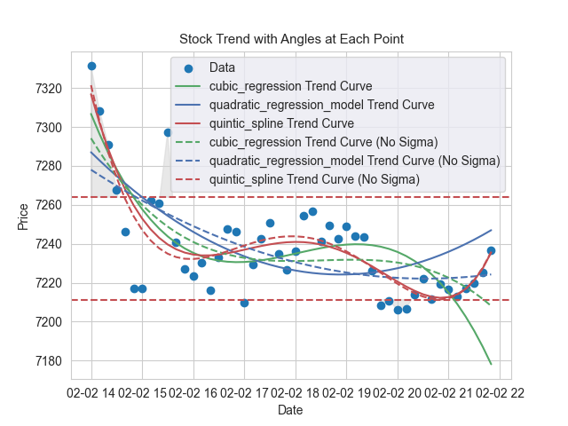

# data-analytics
Welcome to the Data-Analytics repository

Welcome to the Data-Analytics repository, your comprehensive resource for data exploration, manipulation, and visualization. This repository is a home to multifaceted data analysis tools and techniques that provide innovative insights into various datasets.

treasury_cash.py

You can also follow me on Twitter at to stay up-to-date on the latest developments.

[Twitter!]( https://twitter.com/James12396379)

[Paypal](https://www.paypal.com/cgi-bin/webscr?cmd=_s-xclick&hosted_button_id=EV8XUGXX76UXQ&source=url)

### BTC Address: 3QjWqhQbHdHgWeYHTpmorP8Pe1wgDjJy54

### ETH Address: 0x01d23570c34A78380452A4BE9C95bAe439719bAf

Thank you for your support!
